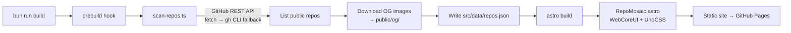

<div align="center">

# 🗺️ archont561

**GIS &amp; geospatial engineering — QGIS plugins, terrain tooling, and systems in Rust &amp; Python.**

A self-updating portfolio built with **Bun + Astro + Starlight** that rebuilds a
**mosaic of every public GitHub repository** on each deploy.

[](https://archont561.github.io/archont561/)


</div>

---

> [!NOTE]
> This repository doubles as my **GitHub profile README** *and* the source for my
> portfolio site. 👉 **[Visit the live site →](https://archont561.github.io/archont561/)**

## ✨ What this is

A portfolio site whose project list is **never hand-maintained**. A build step scans
the GitHub API for every public repo and renders each one's live **social-preview
image** into a filterable mosaic — so the site is always in sync with my work.

- 🧩 **Repository mosaic** — every tile is a repo's GitHub OpenGraph card.
- 🔎 **Filter by language** — Rust, Python, R, Astro, …
- ⚙️ **Self-updating** — regenerated on every deploy (and weekly via cron).
- ⚡ **Fast & static** — shipped as pre-rendered HTML to GitHub Pages.

## 🏗️ How the build works



The `prebuild` npm lifecycle hook runs the scanner **before** Astro builds, so
`src/data/repos.json` and the OG images are always fresh when the site compiles.

## 🧰 Tech stack

| Layer            | Choice                                             |
| ---------------- | -------------------------------------------------- |
| Runtime / PM     | [Bun](https://bun.sh)                              |
| Framework        | [Astro](https://astro.build) + [Starlight](https://starlight.astro.build) |
| Components       | [WebCoreUI](https://webcoreui.dev) (`Badge`, `AspectRatio`, `Ribbon`) |
| Styling          | [UnoCSS](https://unocss.dev) (WebCoreUI tokens pre-compiled to plain CSS) |
| Data source      | GitHub REST API (`fetch`, with `gh` CLI fallback)  |
| CI / Hosting     | GitHub Actions → GitHub Pages                      |

## 🚀 Local development

> [!TIP]
> Requires [Bun](https://bun.sh). In dev the site is served at the **root** (`/`);
> in production it's based under `/archont561` for the Pages project site.

```bash
bun install       # install dependencies
bun run dev       # scan repos, then start the dev server
bun run build     # scan repos, then build to ./dist
bun run preview   # preview the production build
```

Handy scripts:

```bash
bun run scan      # re-scan GitHub repos → src/data/repos.json
bun run tokens    # regenerate WebCoreUI design tokens (after upgrading webcoreui)
```

<details>
<summary>⚙️ <strong>Configuration (environment variables)</strong></summary>

<br/>

| Variable        | Default        | Purpose                                       |
| --------------- | -------------- | --------------------------------------------- |
| `GITHUB_USER`   | `archont561`   | Which GitHub login to scan.                   |
| `GITHUB_TOKEN`  | *(unset)*      | Raises API rate limits; provided by CI.       |
| `INCLUDE_FORKS` | `false`        | Set `true` to include forked repositories.    |
| `INCLUDE_SELF`  | `false`        | Set `true` to include this profile repo.      |

</details>

<details>
<summary>📁 <strong>Project structure</strong></summary>

<br/>

```text
.
├── scripts/
│   ├── scan-repos.ts     # prebuild: scan GitHub → repos.json + OG images
│   └── gen-tokens.ts     # compile WebCoreUI --w-* tokens to plain CSS
├── src/
│   ├── components/RepoMosaic.astro
│   ├── content/docs/     # Starlight pages (home, mosaic, about, how-it-works)
│   ├── data/repos.json   # generated (git-ignored)
│   ├── lib/languageColors.ts
│   └── styles/           # webcore-tokens.css (generated) + custom.css
├── public/og/            # generated OG images (git-ignored)
├── .github/workflows/deploy.yml
├── astro.config.mjs
└── uno.config.ts
```

</details>

## 🌐 Deployment

Pushing to `main` triggers **[the Pages workflow](.github/workflows/deploy.yml)**,
which runs the repo scan, builds with Astro, and deploys to GitHub Pages. A weekly
cron keeps the mosaic fresh even without new commits.

- [ ] Enable **Settings → Pages → Build and deployment → GitHub Actions**
- [x] Workflow, scanner, and site are ready to go

---

<div align="center">
<sub>Built with 🗺️ + ⚡ · <a href="https://archont561.github.io/archont561/">archont561.github.io/archont561</a></sub>
</div>
