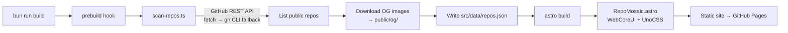

# 📦 Portfolio Source — Repository Docs

Source code and technical documentation for **[archont561.github.io/archont561](https://archont561.github.io/archont561/)**, the self-updating portfolio site and GitHub profile repository for [@Archont561](https://github.com/Archont561).

<div align="center">

[](https://archont561.github.io/archont561/)
[](https://github.com/Archont561)


[](https://github.com/Archont561/archont561/actions/workflows/deploy.yml)

</div>

> 💡 *Looking for the profile overview? See [README.md](README.md).*

---

## ✨ Overview

A portfolio site whose project list is **never hand-maintained**. A build step scans the GitHub API for every public repository and renders each one's live **social-preview image** into a filterable mosaic — so the portfolio is always in sync with GitHub activity.

- 🧩 **Repository mosaic** — every tile is a repository's GitHub OpenGraph card.
- 🔎 **Filter by language** — Rust, Python, R, Astro, and more.
- ⚙️ **Self-updating** — regenerated on every deploy (and scheduled weekly via cron).
- ⚡ **Fast & static** — pre-rendered HTML deployed directly to GitHub Pages.

---

## 🏗️ How the build works



The `prebuild` npm lifecycle hook runs the scanner **before** Astro builds, so `src/data/repos.json` and the OG images are always fresh when the site compiles.

---

## 🧰 Tech stack

| Layer | Choice |
| --- | --- |
| Runtime / PM | [Bun](https://bun.sh) |
| Framework | [Astro](https://astro.build) + [Starlight](https://starlight.astro.build) |
| UI Components | [WebCoreUI](https://webcoreui.dev) (`Badge`, `AspectRatio`, `Ribbon`) |
| Styling | [UnoCSS](https://unocss.dev) (WebCoreUI tokens pre-compiled to plain CSS) |
| Data source | GitHub REST API (`fetch`, with `gh` CLI fallback) |
| CI / Hosting | GitHub Actions → GitHub Pages |

---

## 🚀 Local development

> [!TIP]
> Requires [Bun](https://bun.sh). In dev the site is served at the **root** (`/`); in production it's based under `/archont561` for the GitHub Pages project site.

```bash
bun install       # install dependencies
bun run dev       # scan repos, then start dev server (http://localhost:4321)
bun run build     # scan repos, then build static site to ./dist
bun run preview   # preview the production build locally
```

Handy scripts:

```bash
bun run scan      # re-scan GitHub repos → src/data/repos.json
bun run tokens    # regenerate WebCoreUI design tokens (after upgrading webcoreui)
bun run shots     # capture desktop page screenshots to ./screenshots
```

---

## ⚙️ Configuration (Environment Variables)

| Variable | Default | Purpose |
| --- | --- | --- |
| `GITHUB_USER` | `archont561` | Which GitHub login to scan. |
| `GITHUB_TOKEN` | *(unset)* | Raises API rate limits; provided automatically in CI. |
| `INCLUDE_FORKS` | `false` | Set `true` to include forked repositories. |
| `INCLUDE_SELF` | `false` | Set `true` to include this profile repo. |

---

## 📁 Project structure

```text
.
├── .agents/skills/       # Agent skills and development workflows
├── .github/workflows/
│   └── deploy.yml        # GitHub Pages build & deploy workflow
├── public/
│   └── og/               # Cached OpenGraph cards (generated, git-ignored)
├── scripts/
│   ├── scan-repos.ts     # Prebuild: scans GitHub API → repos.json + OG images
│   ├── gen-tokens.ts     # Compiles WebCoreUI tokens to plain CSS
│   └── screenshots.mjs   # Headless Chromium snapshot script
├── src/
│   ├── assets/           # Static hero images & logos
│   ├── components/
│   │   ├── RepoMosaic.astro     # Main mosaic component
│   │   └── ThemeProvider.astro  # Dark mode provider
│   ├── content/docs/     # Starlight documentation pages
│   │   ├── index.mdx            # Splash landing page
│   │   ├── about.md             # About me page
│   │   └── projects/            # Mosaic & how-it-works pages
│   ├── data/repos.json   # Scanned repository metadata (generated)
│   ├── lib/              # Helper utilities (e.g. language colors)
│   └── styles/           # CSS & token definitions
├── astro.config.mjs      # Astro & Starlight configuration
├── package.json          # Dependencies & npm scripts
├── README.md             # Profile card README
├── README.repo.md        # Technical repository docs (this file)
└── uno.config.ts         # UnoCSS configuration
```

---

## 🌐 Deployment

Pushing to `main` triggers **[the Pages workflow](.github/workflows/deploy.yml)**, which runs the repo scan, builds with Astro, and deploys to GitHub Pages. A scheduled weekly cron keeps the repository mosaic fresh even without new commits.

- [x] Workflow, scanner, and site configured and ready to go.
